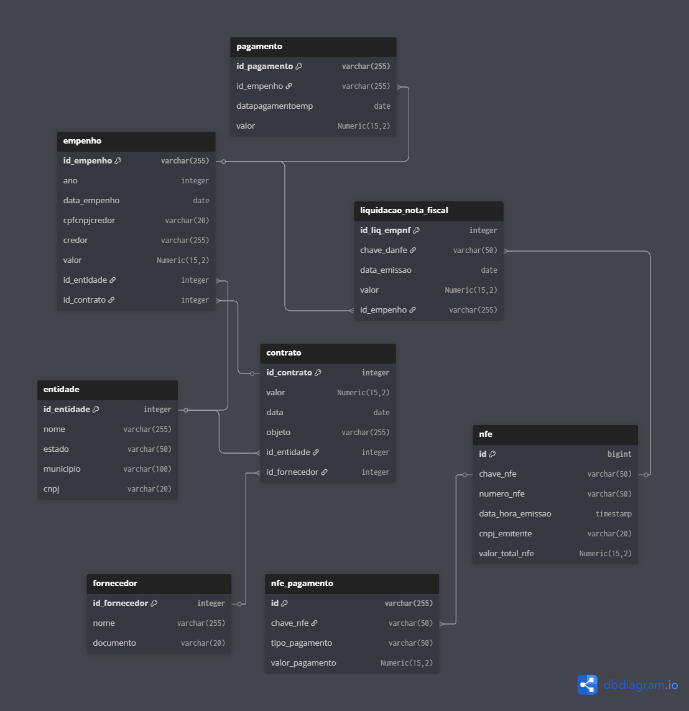

# Fluxo da Despesa Pública: Modelo de Dados

## 1. Os Atores Envolvidos

* **Quem compra (`entidade`):** Representa o órgão público (governo, prefeitura, autarquia) que está realizando a compra.
* **Quem vende (`fornecedor`):** É a empresa ou pessoa contratada para prestar o serviço ou vender o produto.

---

## 2. O Fluxo da Despesa

O modelo conecta as tabelas seguindo a ordem cronológica do gasto público:

###  Fase 1: Contratação (`contrato`)
Tudo começa com um contrato assinado entre a **entidade** e o **fornecedor**.
* Esta tabela guarda o objeto (o que está sendo comprado), o valor total e as datas de vigência.

### Fase 2: Empenho (`empenho`)
No setor público, antes de gastar, o governo precisa "reservar" o dinheiro do orçamento para garantir que poderá pagar. Isso se chama **Empenho**.
* A tabela `empenho` vincula essa reserva ao contrato original e define o credor (quem vai receber).

### Fase 3: Liquidação (`liquidacao_nota_fiscal` e `nfe`)
A liquidação é o momento em que o governo confere se o produto foi entregue ou o serviço prestado.
* **`nfe`**: Armazena os dados da Nota Fiscal Eletrônica emitida pelo fornecedor.
* **`liquidacao_nota_fiscal`**: Conecta essa nota fiscal ao empenho, atestando que aquele valor específico pode ser pago.

### Fase 4: Pagamento (`pagamento` e `nfe_pagamento`)
É a finalização do processo, onde o dinheiro é efetivamente transferido.
* **`pagamento`**: Registra a data do desembolso e o vínculo com o empenho.
* **`nfe_pagamento`**: Detalha a forma como a nota fiscal específica foi paga.

---

### Diagrama de Relacionamento

# Estratégia de Modelagem e Integridade

A modelagem foi desenhada para garantir a integridade dos dados através do uso rigoroso de Foreign Keys, seguindo uma estrutura relacional padrão.

---

### 1. Estrutura Hierárquica (`1:N`)
Adotou-se relacionamentos de **"um para muitos"**.
* **A lógica:** Um `Contrato` pode ter vários `Empenhos`; um `Empenho` pode ter várias `Liquidações` e `Pagamentos`.
* **O benefício:** Isso evita a duplicação de dados do contrato (redundância) a cada novo pagamento realizado.

### 2. Ponto de Integração (Tabela `empenho`)
A tabela `empenho` funciona como o hub do sistema.
* Tanto as tabelas de `pagamento` quanto as de `liquidacao_nota_fiscal` apontam para o campo `id_empenho`.
* Isso permite agrupar facilmente todos os eventos financeiros de uma compra específica em uma única **query**.

### 3. Rastreabilidade (Tabelas de `NFe`)
Para vincular o documento fiscal ao sistema interno:
* A tabela `liquidacao_nota_fiscal` utiliza a `chave_danfe` para se conectar à tabela `nfe`.
* **Separação de responsabilidades:** Isso separa os dados fiscais dos dados de controle interno.

### 4. Normalização (Tabelas `entidade` e `fornecedor`)
Os dados cadastrais foram separados em tabelas próprias (conhecidas como *Lookups*).
* As tabelas transacionais (`contrato`, `empenho`) armazenam apenas os IDs (`id_entidade`, `id_fornecedor`).
* **Otimização:** Isso reduz o espaço de armazenamento e facilita atualizações cadastrais.

