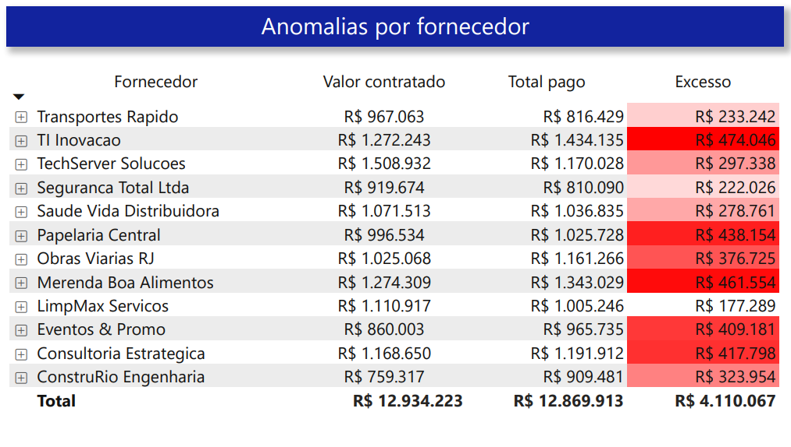
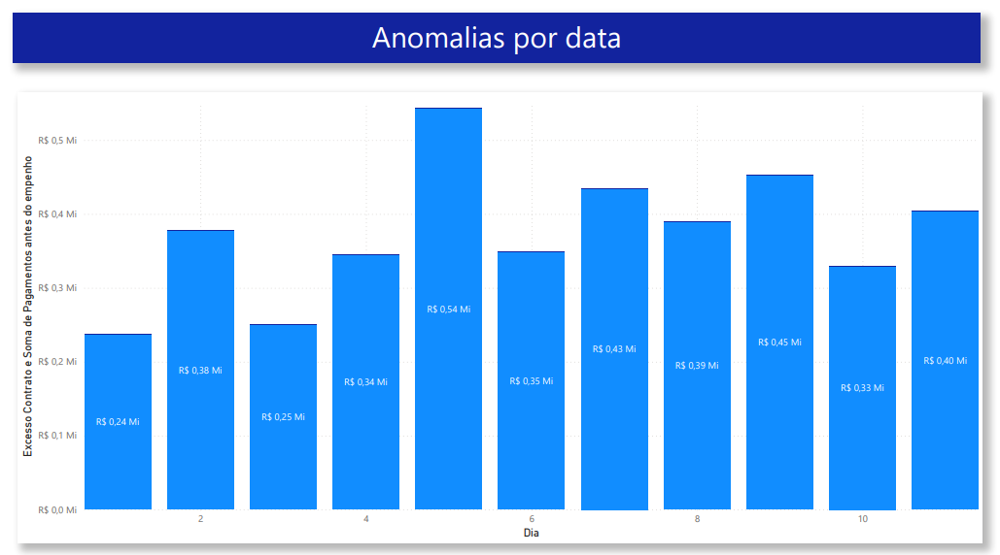

# Questão 3: Visualizações de Dados

Para comunicar os insights gerados na análise de anomalias (Questão 2), foi desenvolvido um painel interativo utilizando o **Microsoft Power BI**. O objetivo é facilitar a identificação visual de contratos excedidos e pagamentos com cronologia invertida.

## 📂 Estrutura dos Arquivos

Nesta pasta, você encontrará os arquivos fonte de dados, o relatório final e imagens estáticas para visualização rápida:

* **`INOVA.pbix`**: Arquivo do projeto Power BI. Contém todas as medidas, relacionamentos e gráficos interativos.
* **`INOVA.pdf`**: Exportação estática do relatório completo.
* **Arquivos `.csv`**: Bases de dados originais utilizadas para alimentar o relatório (`contrato.csv`, `empenho.csv`, `pagamento.csv`, etc.).

## 📊 Como acessar o Relatório Interativo

Para navegar pelos dados, filtrar por município ou detalhar as transações:

1.  Certifique-se de ter o **Microsoft Power BI Desktop** instalado.
2.  Faça o download e abra o arquivo `INOVA.pbix` presente neste diretório.
3.  Ao abrir, você poderá interagir com os gráficos dinâmicos e tabelas.

---

## 🖼️ Galeria de Visualizações

Abaixo estão os painéis desenvolvidos, demonstrando os resultados encontrados na análise exploratória.

### 1. Visão Geral e Geográfica
Este painel sumariza o valor total de anomalias financeiras (R$ 4,11 Mi em excesso de contratos) e procedimentais (41 pagamentos antes do empenho). O mapa de calor destaca a concentração das ocorrências nos municípios do Rio de Janeiro.

### 2. Detalhamento por Fornecedor
Tabela analítica que permite identificar quais empresas receberam valores acima do teto contratual. A coluna "Excesso" destaca a diferença entre o valor pago e o valor do contrato, evidenciando onde estão os maiores desvios.

### 3. Análise Temporal
Gráfico de barras que distribui as anomalias ao longo do tempo (dias), permitindo identificar picos de pagamentos irregulares ou padrões de datas específicas onde ocorreram as inversões cronológicas de empenho.

